# Use Watson Studio and PyTorch to create a machine learning model to recognize handwritten digits

## Overview
Recognizing handwritten numbers is a piece of cake for humans, but it's a non-trivial task for machines. Nowadays, with the advancement of machine learning, people have made machines more and more capable of performing this task. We now have mobile banking apps that can scan checks in seconds and accounting software that can extract dollar amounts from thousands of contracts in minutes. If you are interested in knowing how this all works, please follow along with this code pattern as we take you through the steps to create a simple handwritten digit recognizer in Watson Studio with PyTorch.

## What is Watson Studio?
[Watson Studio](http://dataplatform.cloud.ibm.com/) is an integrated environment for data scientists, developers and domain experts to collaboratively work with data to build, train and deploy models at scale. If you are new to Watson Studio, the best way to understand it is to [see it in action](https://medium.com/ibm-watson/ibm-watson-studio-in-10-videos-6acf96cc608a)

## What is PyTorch?
[PyTorch](https://pytorch.org/) is a relatively new deep learning framework. Yet, it has begun to gain adoption especially among researchers and data scientists. The strength of PyTorch is its support of dynamic computational graph while most deep learning frameworks are based on static computational graph. In addition, its strong NumPy like GPU accelerated tensor computation has allowed Python developers to easily learn and build deep learning networks for GPUs and CPUs alike.

In this code pattern, you will use Jupyter Notebook in Watson Studio and access preinstalled and optimized PyTorch environments through the Python client library of the [Watson Machine Learning](https://console.bluemix.net/catalog/services/machine-learning) service, which has a set of REST APIs in its core that allows users to submit training jobs, monitor status, and store and deploy models.

When you have completed this code pattern, you will understand how to:

* Create a project in Watson Studio and use Jupyter Notebooks in the project.
* Use the Python client of Cloud Object Storage to create buckets and upload data to buckets.
* Submit PyTorch training jobs to Watson Machine Learning service.
* Use the trained PyTorch model to predict handwritten digits from images.

## Flow

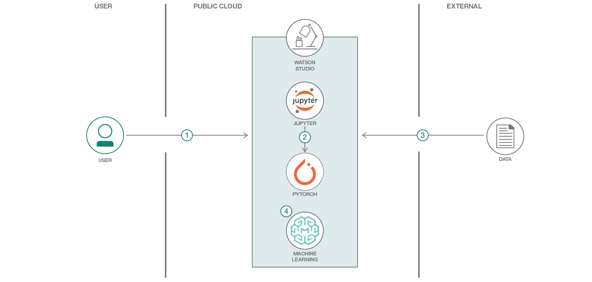

1. Log into IBM Watson Studio 
2. Run the Jupyter notebook in Watson Studio
3. Use PyTorch to download and process the data 
4. Use Watson Machine Learning to train and deploy the model

## Included components

* [IBM Watson Studio](https://www.ibm.com/bs-en/marketplace/data-science-experience): Analyze data using RStudio, Jupyter, and Python in a configured, collaborative environment that includes IBM value-adds, such as managed Spark.
* [Apache Spark](http://spark.apache.org/): An open-source, fast and general-purpose cluster computing system.
* [Jupyter Notebooks](http://jupyter.org/): An open-source web application that allows you to create and share documents that contain live code, equations, visualizations and explanatory text.
* [Watson Studio](https://developer.ibm.com/components/watson-studio-c/): IBM's integrated hybrid environment that provides flexible data science tools to build and train AI models and prepare and analyze data.
* [Cloud Object Storage](https://console.bluemix.net/catalog/services/cloud-object-storage): Provides flexible, cost-effective, and scalable cloud storage for unstructured data.
* [Watson Machine Learning](https://console.bluemix.net/catalog/services/machine-learning): Make smarter decisions, solve tough problems, and improve user outcomes.

## Featured technologies

* [Artificial Intelligence](https://medium.com/ibm-data-science-experience): Artificial intelligence can be applied to disparate solution spaces to deliver disruptive technologies.
* [Python](https://www.python.org/): Python is a programming language that lets you work more quickly and integrate your systems more effectively.

<!--
# Watch the Video

!! COMING !!
 -->

# Steps

1. [Sign up for Watson Studio](#1-sign-up-for-watson-studio)
1. [Create a new project](#2-create-a-new-project)
1. [Create the notebook](#3-create-the-notebook)
1. [Create a Watson Machine Learning Service instance](#4-create-a-watson-machine-learning-service-instance)
1. [Create HMAC credentials for the Cloud Object Storage instance](#5-create-hmac-credentials-for-the-cloud-object-storage-instance)
1. [Run the notebook](#6-run-the-notebook)

### 1. Sign up for Watson Studio

Sign up for IBM's [Watson Studio](https://dataplatform.ibm.com/). By creating a project in Watson Studio a free tier Object Storage service will be created in your IBM Cloud account. Take note of your service names as you will need to select them in the following steps.

Note: When creating your Object Storage service, select the Free storage type in order to avoid having to pay an upgrade fee.

### 2. Create a new project

From the Watson Studio home page, select `New Project`, then select the `Create Project` button located in the `Data Science` tile.

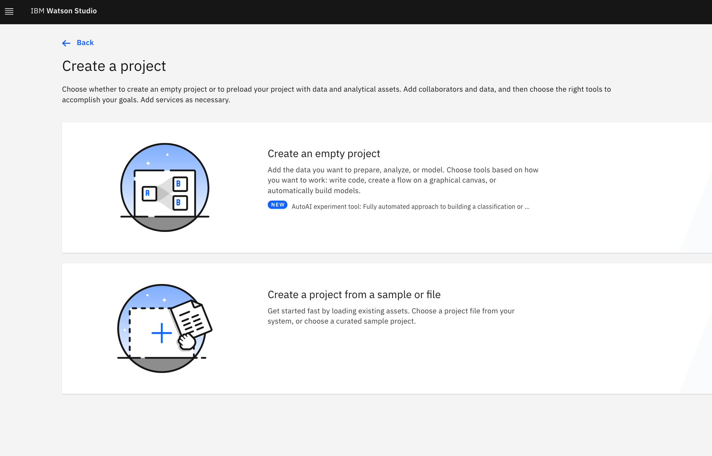

* To create a project in Watson Studio, give the project a name and either create a new Cloud Object Storage service or select an existing one from your IBM Cloud account.

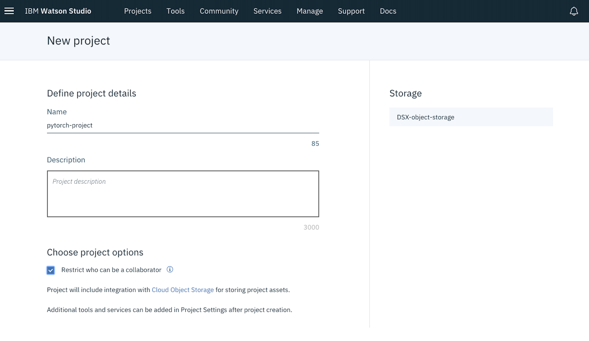

* Upon a successful project creation, you are taken to a dashboard view of your project. Take note of the Assets and Settings tabs, we'll be using them to associate our project with any external assets (such as notebooks) and any IBM Cloud services.

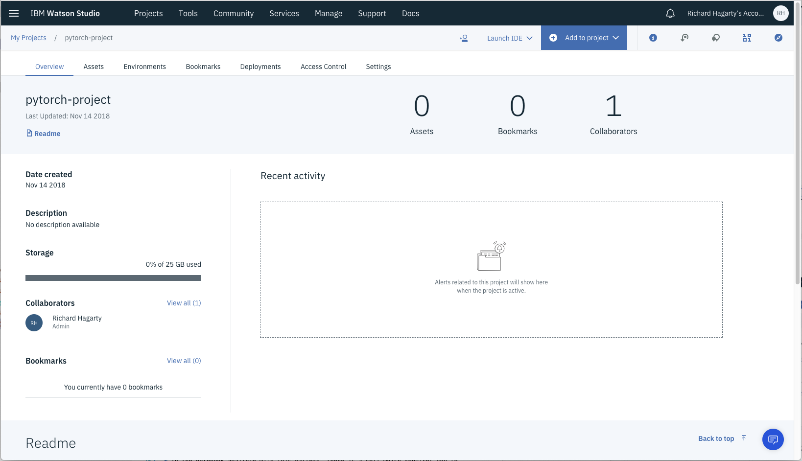

### 3. Create the notebook

From the project dashboard view, select the `Add to project` drop-down menu and click on `Notebook`.

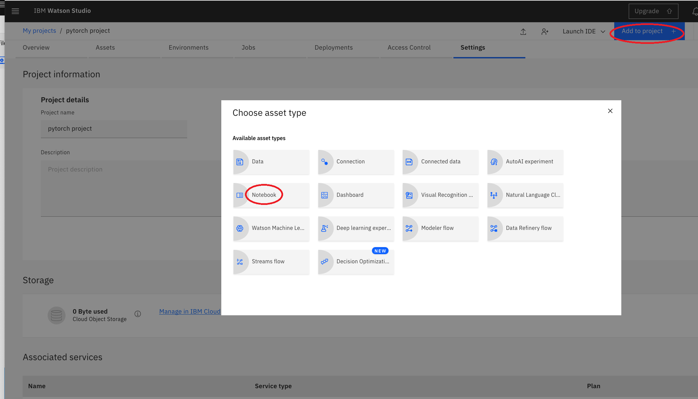

Use the `From URL` tab to create our notebook.

* Give your notebook a name and select your desired runtime. In this case, select the `Default Python 3.5 Free` option.

* For URL, enter the following URL for the notebook stored in our GitHub repository:

  ```
  https://raw.githubusercontent.com/IBM/pytorch-on-watson-studio/master/notebooks/use-pytorch-to-predict-handwritten-digits.ipynb
  ```

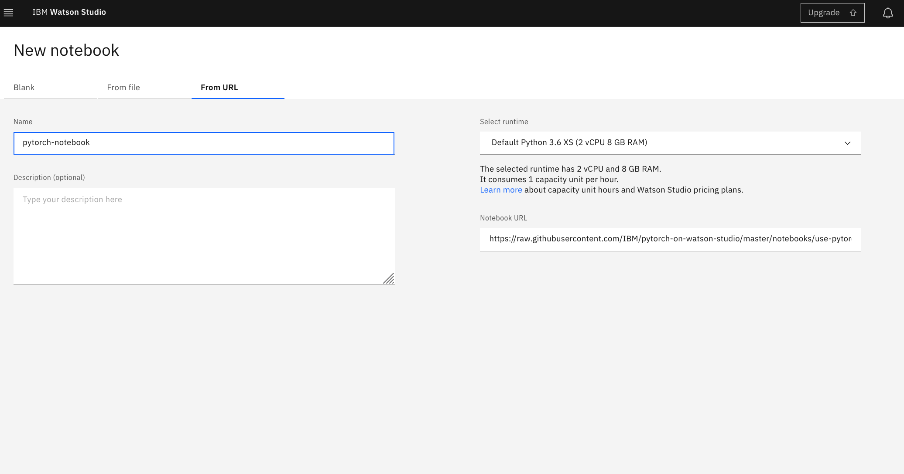

* Press the `Create Notebook` button.

### 4. Create a Watson Machine Learning Service instance

If you do not already have a running instance of the Watson Machine Learning (WML) service, follow these steps to create one.

* From the IBM Cloud Catalog, under the AI category, select [Machine Learning](https://console.bluemix.net/catalog/services/machine-learning).

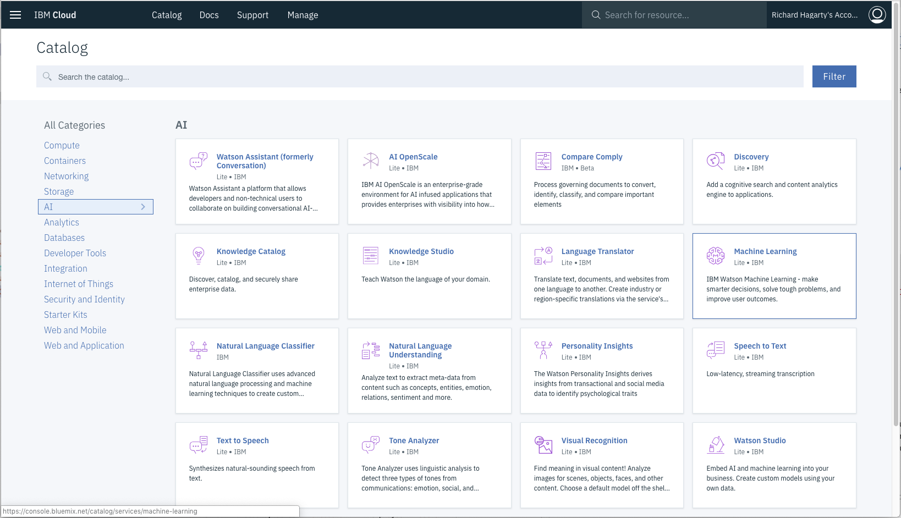

* Enter a service name, select the `Lite` plan, then press `Create`.

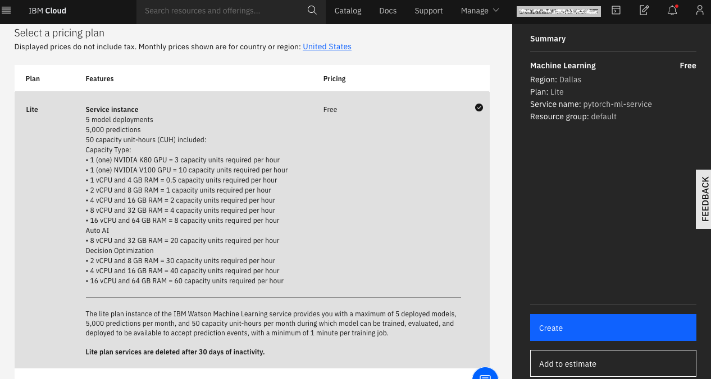

* Once the service instance is created, navigate to `Service credentials`, view credentials and make note of them.

  > Note: If you don't see any credentials available, create a New credential.

  <!-- TODO: Need workaround here -->

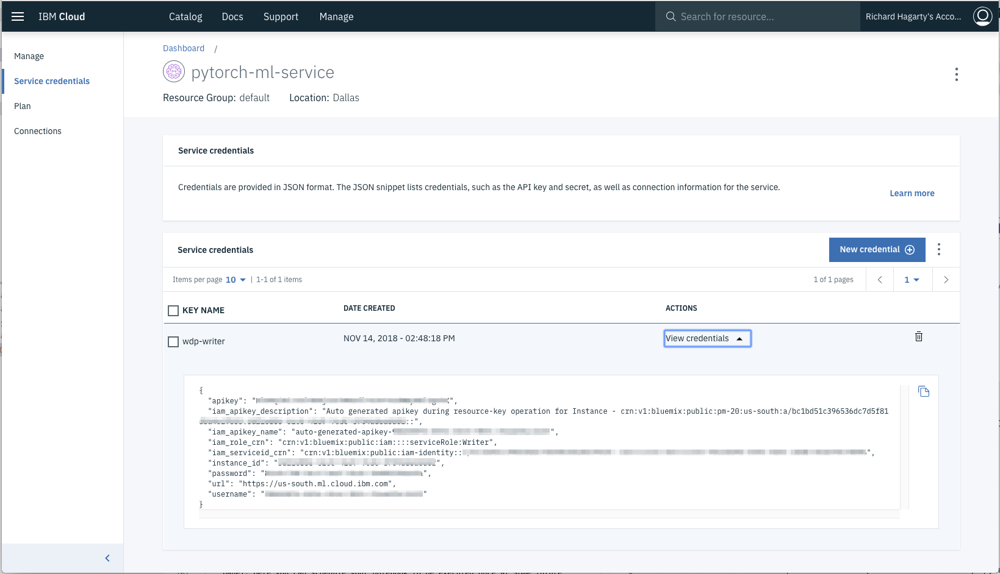

* In the notebook available with this pattern, there is a cell which requires you to enter your WML credentials. Copy and paste these credentials into that notebook cell.

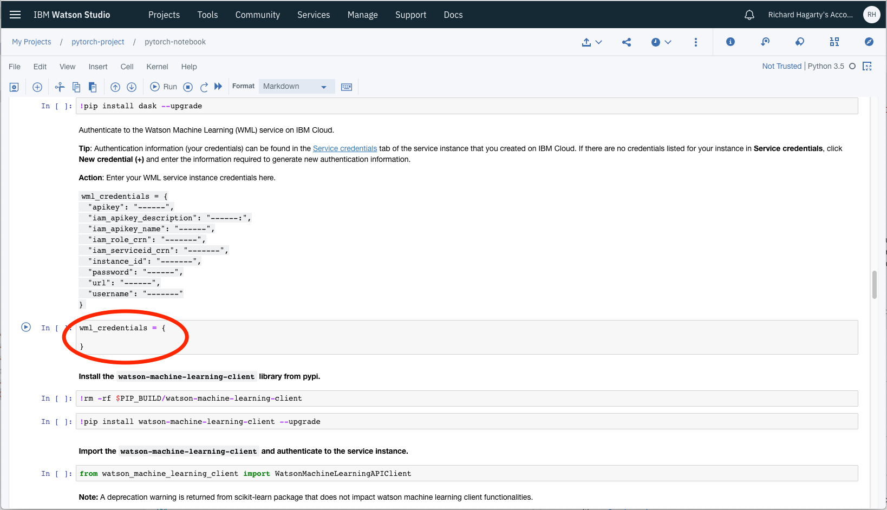

### 5. Create HMAC credentials for the Cloud Object Storage instance

To run the notebook available with this pattern, you must create a `Keyed-Hashing for Message Authentication` (HMAC) set of credentials for your Cloud Object Storage instance.

* From the IBM Cloud dashboard, click on the Cloud Object Storage instance that you assigned to your Watson Studio project. Then click the `Service credentials` tab.

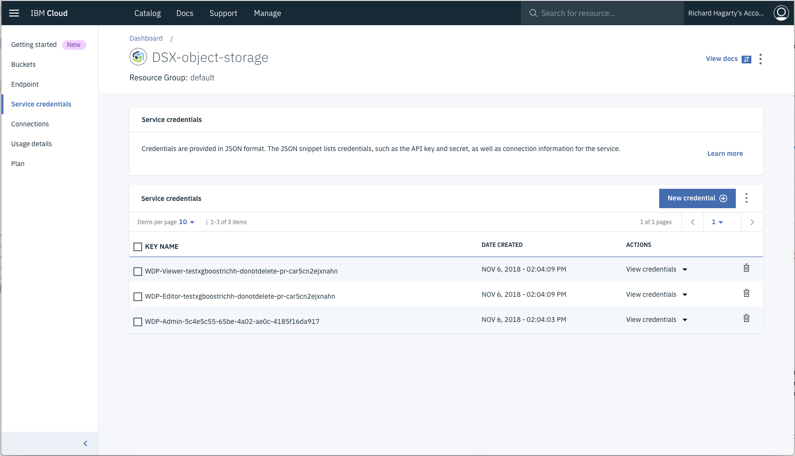

* Click on `New Credential` to initiate creating a new set of credentials. Enter a name, then enter `{"HMAC":true}` in the `Add Inline Configuration Parameters` field. Press `Add` to create the credentials.

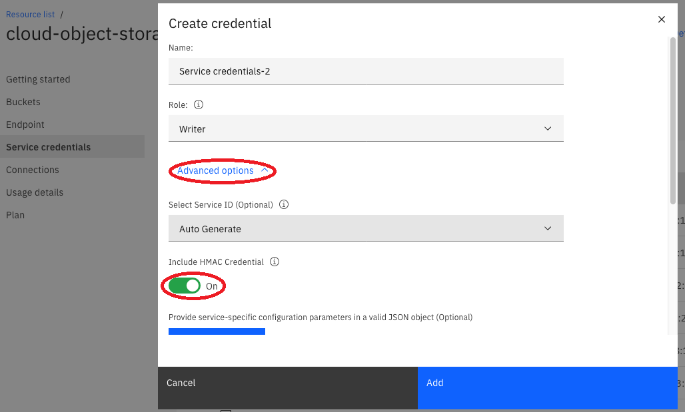

* Once the credentials are created, you should see a set of `cos_hmac_keys` values.

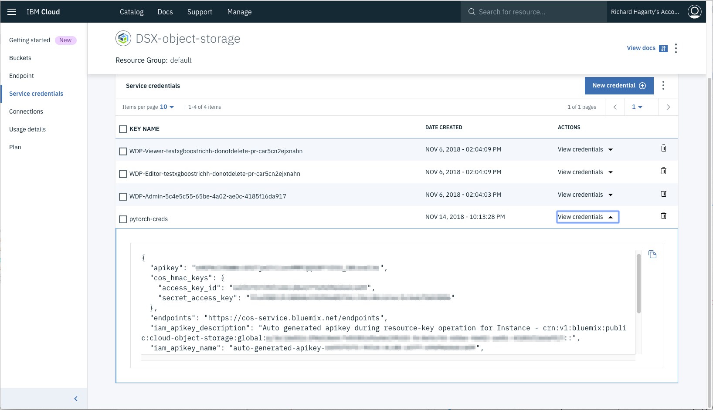

* In the notebook available with this pattern, there is a cell which requires you to enter your Cloud Object Storage credentials. Copy and paste these credentials into that notebook cell.

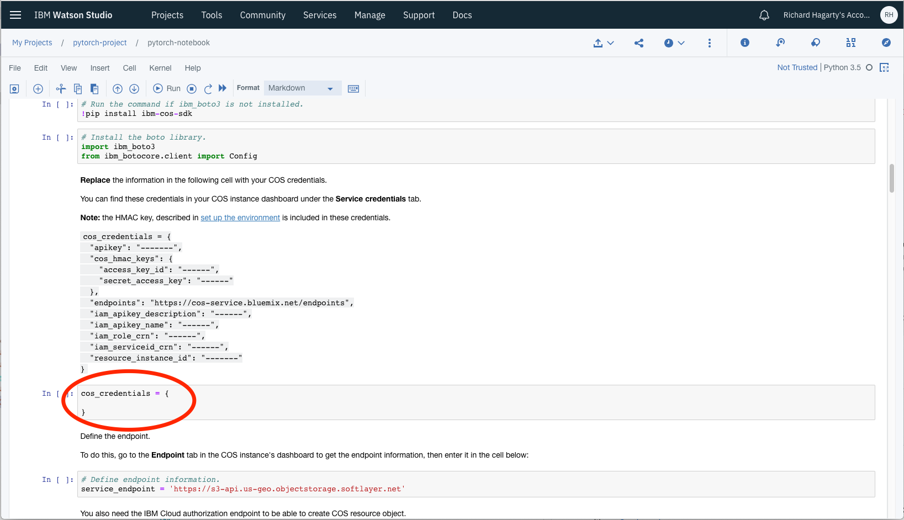

### 6. Run the notebook

To view your notebooks, select `Notebooks` in the project `Assets` list. To run a notebook, simply click on the `edit` icon listed in the row associated with the notebook in the `Notebooks` list.

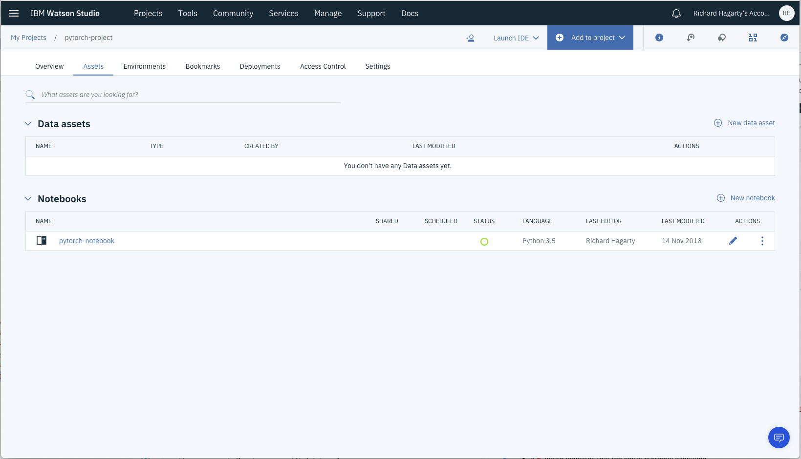

Some background on executing notebooks:

> When a notebook is executed, what is actually happening is that each code cell in
the notebook is executed, in order, from top to bottom.
>
> Each code cell is selectable and is preceded by a tag in the left margin. The tag
format is `In [x]:`. Depending on the state of the notebook, the `x` can be:
>
>* A blank, this indicates that the cell has never been executed.
>* A number, this number represents the relative order this code step was executed.
>* A `*`, which indicates that the cell is currently executing.
>
>There are several ways to execute the code cells in your notebook:
>
>* One cell at a time.
>   * Select the cell, and then press the `Play` button in the toolbar.
>* Batch mode, in sequential order.
>   * From the `Cell` menu bar, there are several options available. For example, you
    can `Run All` cells in your notebook, or you can `Run All Below`, that will
    start executing from the first cell under the currently selected cell, and then
    continue executing all cells that follow.
>* At a scheduled time.
>   * Press the `Schedule` button located in the top right section of your notebook
    panel. Here you can schedule your notebook to be executed once at some future
    time, or repeatedly at your specified interval.

# Sample output

# Links

* [Create Watson Studio Notebooks](https://datascience.ibm.com/docs/content/analyze-data/creating-notebooks.html)

# Learn more

* **Data Analytics Code Patterns**: Enjoyed this Code Pattern? Check out our other [Data Analytics Code Patterns](https://developer.ibm.com/code/technologies/data-science/)
* **AI and Data Code Pattern Playlist**: Bookmark our [playlist](https://www.youtube.com/playlist?list=PLzUbsvIyrNfknNewObx5N7uGZ5FKH0Fde) with all of our Code Pattern videos
* **Watson Studio**: Master the art of data science with IBM's [Watson Studio](https://datascience.ibm.com/)
* **Spark on IBM Cloud**: Need a Spark cluster? Create up to 30 Spark executors on IBM Cloud with our [Spark service](https://console.bluemix.net/catalog/services/apache-spark)

# License
[Apache 2.0](LICENSE)
